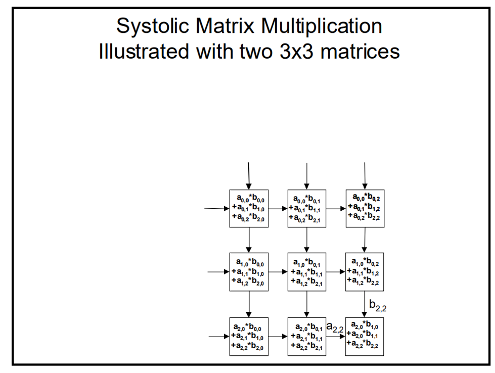

# matrix_multiply

NWPU System-On-Chip(SOC) 2025 matrix multiply accelerator


## 题目

矩阵运算是AI加速芯片中最主要的运算部件。请设计一种矩阵乘法运算加速单元。在尽可能提高加速效果的前提下，减少硬件代价，给出合理的实现矩阵乘法运算的数据通路结构，粗略估算完成矩阵AxB运算的周期数（A、B两个矩阵的大小都是256x256）


## 介绍

> 参考链接：
>
> 【基于FPGA脉动阵列设计与实现（世上最全：原理+Verilog实现讲解）】https://www.bilibili.com/video/BV19vr5Y6E8c

### 功能介绍

256×256大小的矩阵相乘，其中各数值范围为0-15。

256×256大小的结果矩阵，其中各数值范围为0-65535


包含verilog实现与python测试脚本。


### 原理介绍

以3×3矩阵相乘为例





### 文件介绍

#### verilog

##### Top_systolic.sv

硬件电路


##### tb_systolic.sv

读取矩阵A与B，输入硬件电路后读出结果，最后写入csv文件。


#### python

##### generate_results.py

产生符合条件的256×256大小矩阵A与B。写入csv文件。


##### compare_results.py

python计算矩阵A×B，读取硬件电路计算结果，进行比较。如果不同则输出diff部分到csv文件，否则pass。


## 运行

### 生成测试矩阵

```bash
python generate_data.py
```


### 运行testbench

Questasim

```shell
vsim -do run.do
```


### 检查矩阵

```bash
python compare_results.py
```


